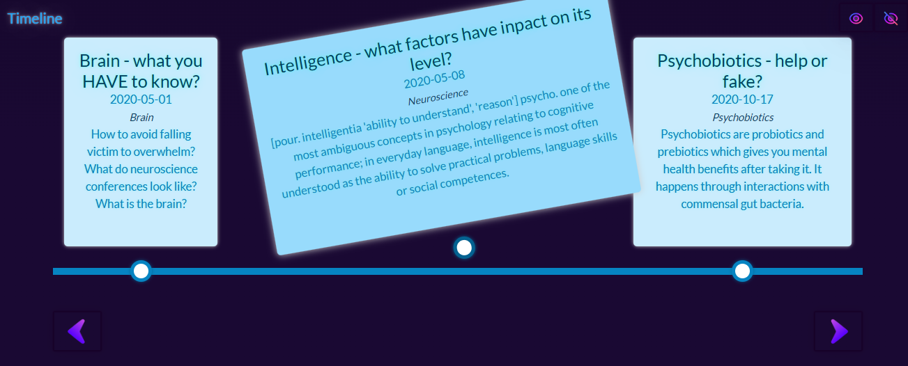
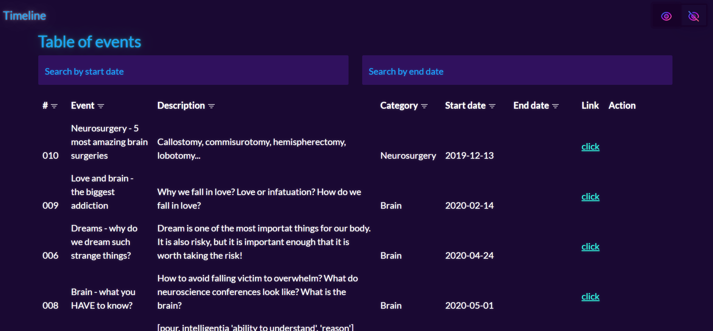

# Timeline - JavaScript



## About
Timeline is a simple single-page application where you can use sample data included in the project.

You can add your own events (created events are only visible in the table). 

## Content
- [App examples](./README.md#app-examples)
- [How to run the app?](./README.md#how-to-run-the-app)
  - [Environment](./README.md#environment)
  - [Used technologies](./README.md#used-technologies)
  - [Database](./README.md#database)
  - [Run the app](./README.md#run-the-app)
- [Sources](./README.md#sources)
- [Note](./README.md#note)

## App examples





## How to run the app?
### Environment
- Windows 11 Pro v22H2

### Used technologies
- Visual Studio
- Bootstrap
- HTML
- CSS
- JavaScript

### Database
Exmaple data are in the project in file example-data.js

To see sample data contained in the application, simply press the button located in the upper right corner of the application

### Run the app
Download files from github
```
git clone https://github.com/Susannnnnna/JS_Timeline
```

## Sources


## Note

