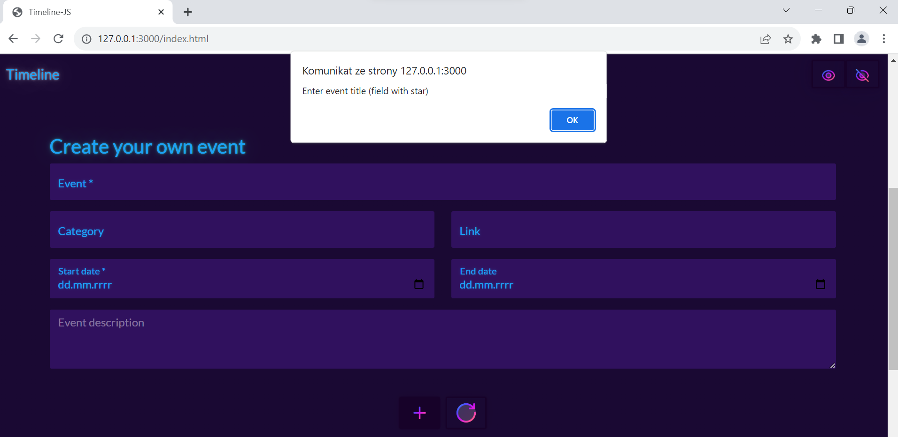

# Timeline - JavaScript


## About
Timeline is a simple single-page application where you can use sample data included in the project.

You can add your own events (created events are only visible in the table). 

## Content
- [App examples](./README.md#app-examples)
- [How to run the app?](./README.md#how-to-run-the-app)
  - [Environment](./README.md#environment)
  - [Used technologies](./README.md#used-technologies)
  - [Database](./README.md#database)
  - [Run the app](./README.md#run-the-app)
- [Testing](./README.md#testing)
- [Documentation](./README.md#documentation)
- [Sources](./README.md#sources)
- [Security](./README.md#security)
- [Note](./README.md#note)
- [License](./README.md#license)
- [Creation time](./README.md#creation-time)

## App examples




## How to run the app?
### Environment
- Windows 11 Pro v22H2
- iOS v16.5
- macOS
- Android
- Linux

### Used technologies
- Qt v
- Visual Studio v
- C++ v
- CMake 
- QML
- C#
- Bootstrap
- HTML
- CSS
- JavaScript
- Microsoft SQL Server Management Studio

### Database
Instruction how to insert example data.

### Run the app
Download files from githube from this repo
```
git clone https://github.com/Susannnnnna/
```

## Testing

## Documentation
- Doxygen

## Sources

## Security

## Note

## License

## Creation time
